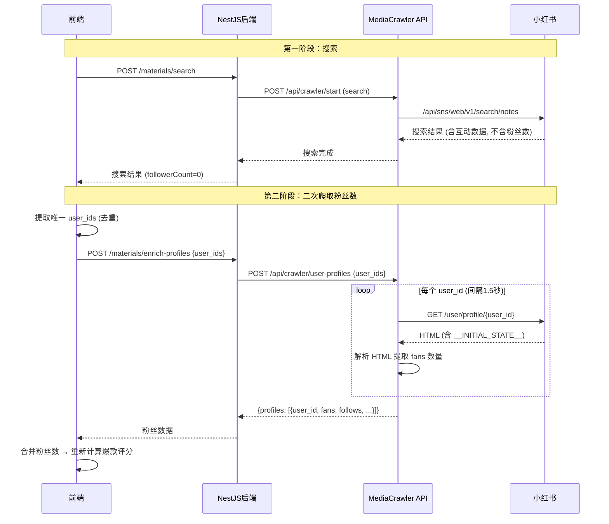

# 爆款内容分析模块方案

> 更新时间: 2026-02-15  
> 模块位置: `api/routers/user_profile.py` + `前端 viral-score.ts`

---

## 1. 模块概述

### 1.1 目标

为搜索结果提供爆款内容识别能力，帮助用户快速定位高传播度、高性价比的优质内容。

### 1.2 核心理念

一条内容是否"爆"，不能只看绝对互动量。**三个维度**共同决定：

| 维度 | 含义 | 举例 |
|------|------|------|
| **互动量** | 点赞/转发/评论绝对值 | 1万赞 vs 100赞 |
| **粉丝效率** | 同样互动量，粉丝少的更爆 | 2000粉获1万赞 > 100万粉获1万赞 |
| **时间速度** | 短时间积累高互动 > 慢慢积累 | 7天获1万赞 > 1年获1万赞 |

---

## 2. 评分算法

### 2.1 评分公式

```
viralScore = rawScore × followerMultiplier × timeMultiplier
```

#### 2.1.1 rawScore（互动原始分）

```
rawScore = (likes / minLikes) × 0.5
         + (shares / minShares) × 0.3
         + (comments / minComments) × 0.2
```

- `minLikes` / `minShares` / `minComments` 是用户可调的阈值
- 达到阈值时该项得分为 1.0
- 超过阈值按比例增加

#### 2.1.2 followerMultiplier（粉丝倍率）

```
followerMultiplier = clamp(referenceFollowers / followers, 0.1, 5.0)
```

| 场景 | followers | 倍率 | 说明 |
|------|-----------|------|------|
| 素人爆款 | 2,000 | 5.0 | 50000÷2000=25 → cap 5.0 |
| 中腰部达人 | 50,000 | 1.0 | 基准线 |
| 头部KOL | 1,000,000 | 0.05→0.1 | 折扣 |
| 未知粉丝 | 0 | 1.0 | 不修正（等待二次爬取） |

#### 2.1.3 timeMultiplier（时间倍率）

```
timeMultiplier = clamp(referenceDays / daysSincePublish, 0.1, 5.0)
```

| 场景 | 发布距今 | 倍率 | 说明 |
|------|----------|------|------|
| 刚发布 | 1天 | 5.0 | 30÷1=30 → cap 5.0 |
| 近期内容 | 7天 | 4.3 | 短时间高互动 = 爆 |
| 基准线 | 30天 | 1.0 | 标准 |
| 老内容 | 365天 | 0.08→0.1 | 大幅衰减 |

### 2.2 等级判定

| 等级 | 得分范围 | 标签 | 含义 |
|------|----------|------|------|
| viral | ≥ 3.0 | 🔥🔥 超级爆款 | 高互动+小号+新发布 |
| hot | ≥ 1.0 | 🔥 爆款 | 达到基准爆款线 |
| warm | ≥ 0.5 | 📈 小热门 | 有潜力但未达标 |
| normal | < 0.5 | (无) | 普通内容 |

### 2.3 用户可调参数

| 参数 | 默认值 | 说明 |
|------|--------|------|
| `minLikes` | 1000 | 点赞数基准阈值 |
| `minShares` | 200 | 转发数基准阈值 |
| `minComments` | 10 | 评论数基准阈值 |
| `referenceFollowers` | 50000 | 粉丝数参考基准线 |
| `referenceDays` | 30 | 时间窗口参考基准（天） |

---

## 3. 二次爬取架构（粉丝数获取）

### 3.1 为什么需要二次爬取

小红书搜索 API (`/api/sns/web/v1/search/notes`) 返回的数据**不包含作者粉丝数**。
粉丝数仅在作者主页 (`/user/profile/{user_id}`) 的 `window.__INITIAL_STATE__` 中可获取。

### 3.2 数据流



### 3.3 API 端点

#### MediaCrawler 端 (`POST /api/crawler/user-profiles`)

**请求：**
```json
{
  "platform": "xhs",
  "user_ids": ["user_id_1", "user_id_2", "...最多20个"]
}
```

**响应：**
```json
{
  "platform": "xhs",
  "profiles": [
    {
      "user_id": "user_id_1",
      "nickname": "用户昵称",
      "fans": 12500,
      "follows": 300,
      "interaction": 45000,
      "avatar": "https://...",
      "desc": "个人简介",
      "error": null
    },
    {
      "user_id": "user_id_2",
      "error": "HTTP 404"
    }
  ],
  "fetched": 1,
  "failed": 1
}
```

#### NestJS 后端代理 (`POST /materials/enrich-profiles`)

代理转发到 MediaCrawler，无额外逻辑。

**请求：**
```json
{
  "platform": "xhs",
  "user_ids": ["user_id_1", "user_id_2"]
}
```

### 3.4 技术实现细节

#### 3.4.1 粉丝数提取方式

```python
# 访问用户主页 HTML
url = f"https://www.xiaohongshu.com/user/profile/{user_id}"
# 解析 window.__INITIAL_STATE__ 中的 JSON
info = json.loads(match.group(1).replace(":undefined", ":null"))
user_page = info["user"]["userPageData"]

# 提取互动数据
interactions = user_page.get("interactions", [])
for item in interactions:
    if item["type"] == "fans":
        fans = item["count"]  # 可能是 "1.2万" 格式
```

#### 3.4.2 中文数字解析

```python
def _parse_chinese_count(text: str) -> int:
    if "万" in text:
        return int(float(text.replace("万", "")) * 10000)
    elif "亿" in text:
        return int(float(text.replace("亿", "")) * 100000000)
    return int(text)
```

#### 3.4.3 Cookie 复用

二次爬取复用搜索阶段的 XHS cookies（从 `browser_data/` 目录读取 Chrome Cookie 数据库）。

#### 3.4.4 速率控制

- 最多同时获取 **20 个**用户（防滥用）
- 每个请求间隔 **1.5 秒**（防风控）
- 失败不阻塞（返回 error 字段，评分回退到 followerMultiplier=1.0）

---

## 4. 文件结构

### 4.1 MediaCrawler 侧

```
MediaCrawler/
├── api/
│   ├── main.py                          # 注册 user_profile_router
│   ├── routers/
│   │   ├── __init__.py                  # 导出 user_profile_router
│   │   ├── user_profile.py             # ★ 新增：用户画像 API
│   │   └── ...
│   └── ...
├── media_platform/xhs/
│   ├── client.py                        # get_creator_info() — 已有方法
│   └── extractor.py                     # extract_creator_info_from_html() — 已有方法
└── docs/
    └── 爆款分析模块方案.md              # ★ 本文档
```

### 4.2 NestJS 后端侧

```
libraries/nestjs-libraries/src/materials/
├── materials.crawler.service.ts         # ★ 新增 getUserProfiles() 方法
└── ...

apps/backend/src/api/routes/
├── materials.controller.ts              # ★ 新增 POST /enrich-profiles 端点
└── ...
```

### 4.3 前端侧

```
apps/frontend/src/components/materials/
├── viral-score.ts                       # ★ 爆款评分算法 v2 (三维度)
├── materials-viral-settings.component.tsx # ★ 阈值设置面板
├── materials.component.tsx              # ★ 集成二次爬取 + 评分
├── materials-results.component.tsx      # ★ 卡片展示 (粉丝+时间+倍率)
└── materials-search.component.tsx       # 搜索栏（中文化）
```

---

## 5. 卡片展示设计

每张搜索结果卡片展示：

```
┌──────────────────────────┐
│  [封面图]                 │
│  🔥🔥 超级爆款   [3.5]    │  ← 左上角等级标签 + 右上角得分
├──────────────────────────┤
│  标题/描述 (2行截断)       │
│                          │
│  👤 作者名  [1.2w粉]      │  ← 作者 + 粉丝数 (二次爬取)
│  ⚡ 3天前  ↑5.0x  ⏫4.3x  │  ← 发布时间 + 粉丝倍率 + 时间倍率
│                          │
│  ❤️ 1.2万  ⭐ 3k  💬 500   │  ← 互动数据
│     🔗 200                │
└──────────────────────────┘
```

### 5.1 倍率指标说明

| 指标 | 含义 | 颜色 |
|------|------|------|
| `↑5.0x` | 粉丝倍率 > 1 (小号加分) | 绿色 |
| `↓0.1x` | 粉丝倍率 < 1 (大号折扣) | 橙色 |
| `⏫4.3x` | 时间倍率 > 1 (新内容加分) | 蓝色 |
| `⏬0.1x` | 时间倍率 < 1 (老内容减分) | 灰色 |

---

## 6. 使用示例

### 6.1 典型场景

**场景：搜索"护肤"关键词，寻找素人爆款**

1. 设置阈值：
   - `minLikes = 500`
   - `referenceFollowers = 30000`
   - `referenceDays = 14`
   
2. 搜索完成后自动二次爬取粉丝数

3. 评分示例：

| 内容 | 点赞 | 粉丝 | 发布天数 | rawScore | 粉丝倍率 | 时间倍率 | 最终分 | 等级 |
|------|------|------|----------|----------|----------|----------|--------|------|
| 素人护肤帖 | 5000 | 1200 | 3 | 5.0 | 5.0 | 4.7 | **117.5** | 🔥🔥 超级爆款 |
| KOL日常 | 8000 | 500000 | 30 | 8.0 | 0.1 | 1.0 | **0.8** | normal |
| 中腰部达人 | 2000 | 30000 | 7 | 2.0 | 1.0 | 2.0 | **4.0** | 🔥🔥 超级爆款 |
| 老帖高赞 | 10000 | 20000 | 365 | 10.0 | 1.5 | 0.1 | **1.5** | 🔥 爆款 |

### 6.2 过滤模式

- 开启"仅看爆款"：只显示 `viralScore >= 1.0` 的结果
- 结果按爆款分降序排列
- 统计栏显示：总数 / 爆款数 / 已获取粉丝数

---

## 7. 限制与未来改进

### 7.1 当前限制

1. **粉丝数获取延迟**：二次爬取每个用户间隔1.5秒，20个用户需要约30秒
2. **Cookie依赖**：需要有效的登录Cookie才能获取用户主页
3. **中文数字精度**：`1.2万` 解析为 12000，存在精度损失
4. **批量上限**：每次最多获取20个用户的粉丝数
5. **跨平台**：目前仅支持小红书，抖音等平台待扩展

### 7.2 未来改进方向

1. **本地缓存粉丝数**：已获取的粉丝数缓存到本地数据库，下次搜索直接使用
2. **后台异步获取**：搜索完成后在后台异步获取粉丝数，不阻塞用户浏览
3. **互动率排序**：支持按互动率 (totalEngagement / followers) 单独排序
4. **趋势分析**：同一关键词多次搜索，对比爆款趋势变化
5. **导出功能**：导出爆款列表为CSV/Excel，方便分析
6. **抖音适配**：复用相同架构，添加抖音用户粉丝数获取

---

*文档版本: v2.0 | 上次更新: 2026-02-15*
